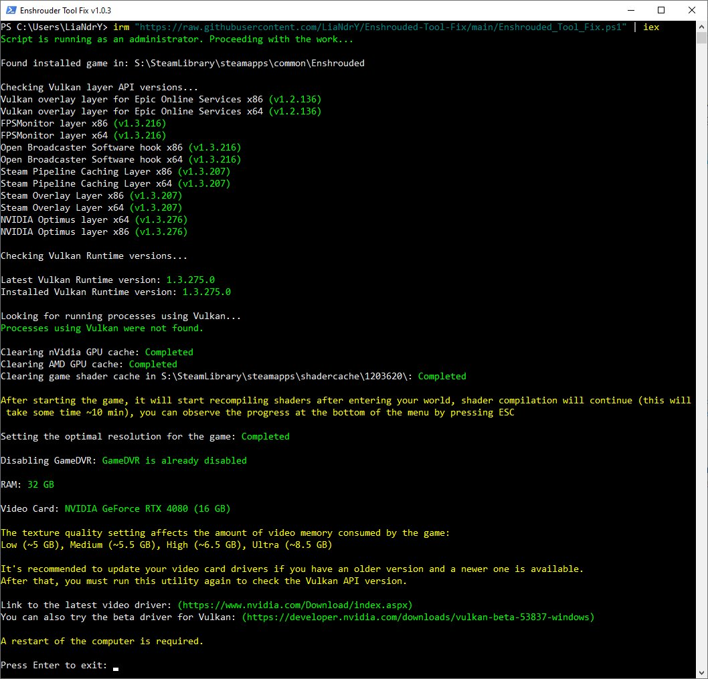

This utility is intended for those who have problems with the game Enshrouded.

It allows you to test your system for various problems with the Vulkan graphics API and help fix them.

It does not give a 100% guarantee that it will help you, but it may clarify some points. This utility was written for my system and nVidia video card, and it is quite possible that it will not work properly on yours.

I tried to take into account many factors to prevent this from happening.


### Startup instructions:
Note: The tool should be launched when the game is closed.

You can open PowerShell as an administrator and paste the command into console:

```powershell
irm "https://raw.githubusercontent.com/LiaNdrY/Enshrouded-Tool-Fix/main/Enshrouded_Tool_Fix.ps1" | iex
```


## Screenshot



## List of changes:

#### v1.1.7

- Added cleaning of Vulkan shader cache from LocalAppData folder

#### v1.1.6

- Improved algorithm for detecting Intel graphics cards

#### v1.1.5

- Added additional output of the path to the problematic JSON file to the screen if one is encountered

#### v1.1.4

- Fixed an issue with nVidia video cards where, after installing a new video driver, the script could not determine the version of the Vulkan layer.

#### v1.1.3

- Improved algorithm for calculating video memory for all brands of video cards

#### v1.1.2

- Added support for Intel video cards

#### v1.1.1

- Added text explanation if the script does not find the installed game
- Fixed detection of AMD video cards

#### v1.1.0

- Added creation of a log file at the end of the script

#### v1.0.14

- Improved paging file checking system
- Added checking for AVX instructions on the CPU

#### v1.0.13

- Added сhecking the parameters of the paging file

#### v1.0.12

- Minor fixes

#### v1.0.11

- Added unlocking of Vulkan Runtime files in the system of AMD video card users for successful update

#### v1.0.10

- Fixed the logic for searching for a video card in the system

#### v1.0.9

- Fixed version definition and API name of the Vulkan layer, if they are empty, in this case the version will be determined as 0.0.000 and the layer will be deleted

#### v1.0.8

- Fixed a problem when running the script through PowerShell versions higher than version 5, it broke the formatting of the json settings file

#### v1.0.7

- Fixed saving json settings files
- Added changing the "sleepInBackground" parameter to false in the enshrouded_local.json file
- Add Increase system responsiveness and network throughput
- Added setting of the "High Performance" energy saving scheme if "Balanced" or "Power saver" is installed
- Minor logic fixes

#### v1.0.6

- Added setting FOV to a minimum value (may help with game crashes)

#### v1.0.5

- Added a correct search for the path to the game, if the launch parameters are specified in Steam

#### v1.0.4

- Changed some value search algorithms
- Added on/off GameDVR
- Changed the logic for searching for the native resolution for the main monitor

#### v1.0.3

- Add check RAM

#### v1.0.2

- First release
